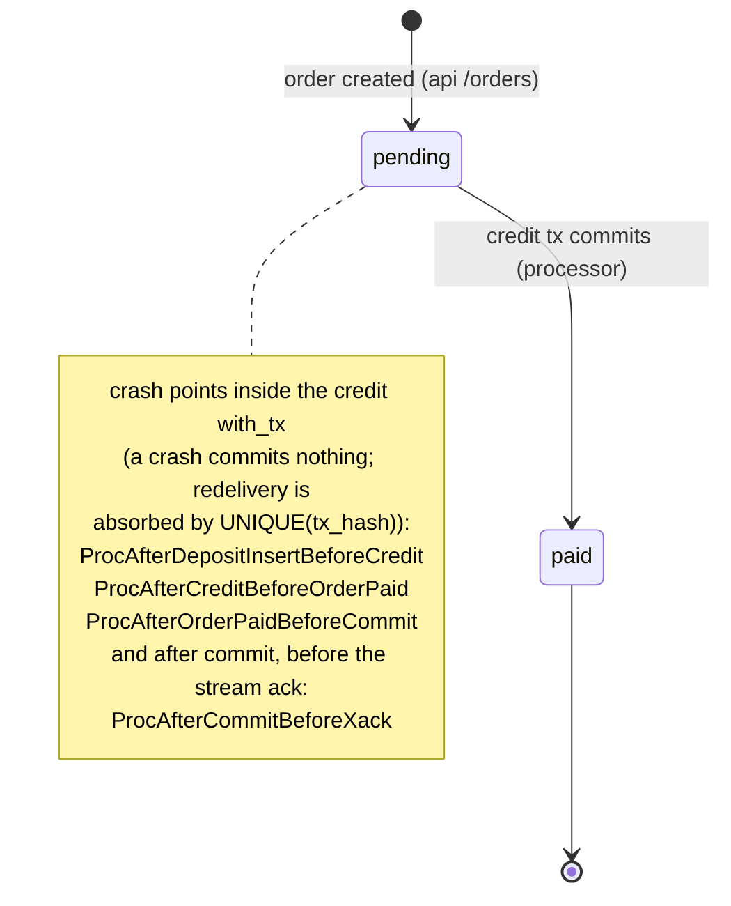
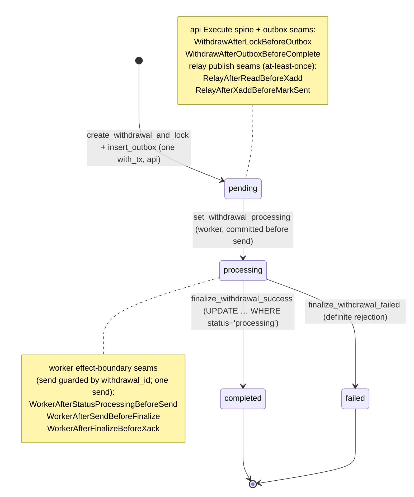
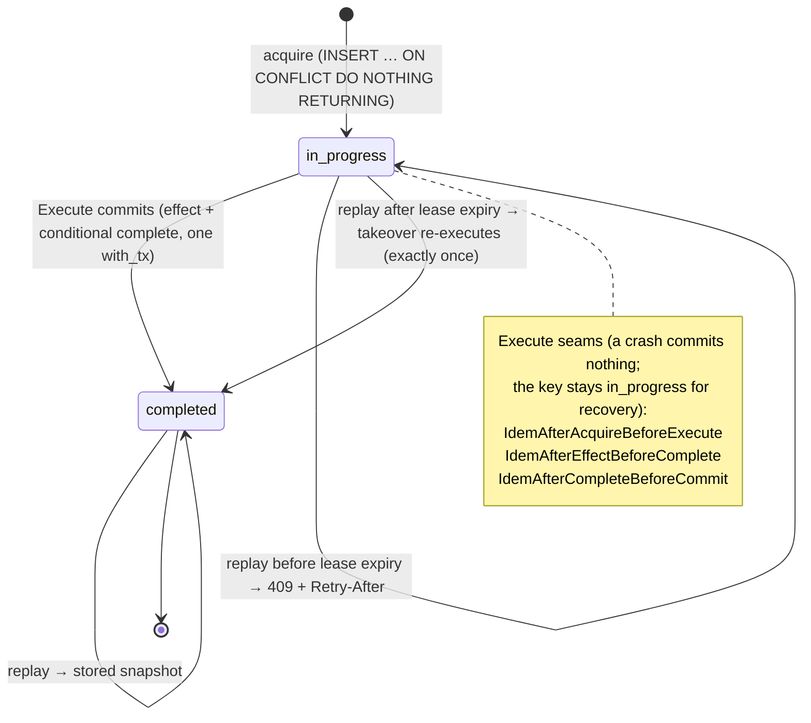

# LIFECYCLE — the state machines, and where the crash points sit

Two business state machines carry the money: the **order** (a payment-in) and the **withdrawal**
(a payment-out). A third, the **inbound idempotency key**, is the spine that makes the keyed write
paths exactly-once. Each `CrashPointId` is placed against the transition it can
interrupt; the rebuilt code is clean at every one (`chaos/results/summary.md`).

Legal transitions are guarded in SQL: an order moves `pending → paid` only via the gated credit
transaction; a withdrawal moves `processing → completed` only via `UPDATE … WHERE
status='processing'`. A crash never produces an illegal state — it either commits the whole
transition or none of it.

---

## 1. Order: `pending → paid`

The processor credits a confirmed deposit and marks the order paid in one `with_tx`. The dedup
(`INSERT … ON CONFLICT (tx_hash) DO NOTHING RETURNING`) gates the balance credit, so a redelivery
credits nothing.



ASCII fallback:

```
        order created                 credit tx commits (processor)
 [*] ───────────────────▶ (pending) ──────────────────────────────▶ (paid) ──▶ [*]
                                │
                                │  crash points on the credit path:
                                │    ProcAfterDepositInsertBeforeCredit
                                │    ProcAfterCreditBeforeOrderPaid
                                │    ProcAfterOrderPaidBeforeCommit
                                └─▶ ProcAfterCommitBeforeXack (after commit, before XACK)
```

---

## 2. Withdrawal: `pending → processing → completed | failed`

Created (funds locked + outbox row, one `with_tx`) by `api`; published by `relay`; driven by
`worker`. `pending → processing` commits **before** the send; from `processing` the worker
reconciles via `signer.lookup` rather than re-sending.



ASCII fallback:

```
   create+lock+outbox (api, one with_tx)        set processing (worker)
 [*] ─────────────────────────────────▶ (pending) ───────────────────▶ (processing)
        seams: WithdrawAfterLockBeforeOutbox          │                      │
               WithdrawAfterOutboxBeforeComplete      │                      │
        relay: RelayAfterReadBeforeXadd               │                      │
               RelayAfterXaddBeforeMarkSent           │                      │
                                                      │   finalize success   │  finalize failed
                                          (processing)├──────────────────────▶ (completed) ─▶ [*]
                                                      └──────────────────────▶ (failed) ────▶ [*]
   worker seams on (processing):
     WorkerAfterStatusProcessingBeforeSend   (processing committed, before send)
     WorkerAfterSendBeforeFinalize           (sent, before finalize — redelivery reconciles via lookup)
     WorkerAfterFinalizeBeforeXack           (finalized, before XACK — redelivery is a terminal no-op)
```

---

## 3. Inbound idempotency key: `in_progress → completed`

Every keyed write (`/orders`, `/withdrawals`) runs its effect through this one spine. `acquire` is
its own committed statement so concurrent replays can *see* `in_progress`; the guarded effect and
the conditional completion commit together, so `completed ⟺ effect applied` (the takeover safety
theorem, `docs/DESIGN.md` §3).



ASCII fallback:

```
   acquire (committed)                     Execute commits (effect + complete, one with_tx)
 [*] ─────────────────▶ (in_progress) ───────────────────────────────────────▶ (completed) ─▶ [*]
                          │   ▲                                                      │
   replay < lease ────────┘   │                                       replay ───────┘ (stored snapshot)
   → 409 + Retry-After        │
   replay > lease ────────────┘  takeover re-executes → exactly one effect → (completed)

   Execute seams (key stays in_progress on a crash; recovered by replay/takeover):
     IdemAfterAcquireBeforeExecute
     IdemAfterEffectBeforeComplete
     IdemAfterCompleteBeforeCommit
```

---

Every transition above, crossed with every redelivery schedule, holds under a process crash at the
marked seams: `chaos/results/summary.md` (62/62 passed, 14/14 crash points reached), with the legacy
counterexamples in `chaos/results/before-after.md`.
